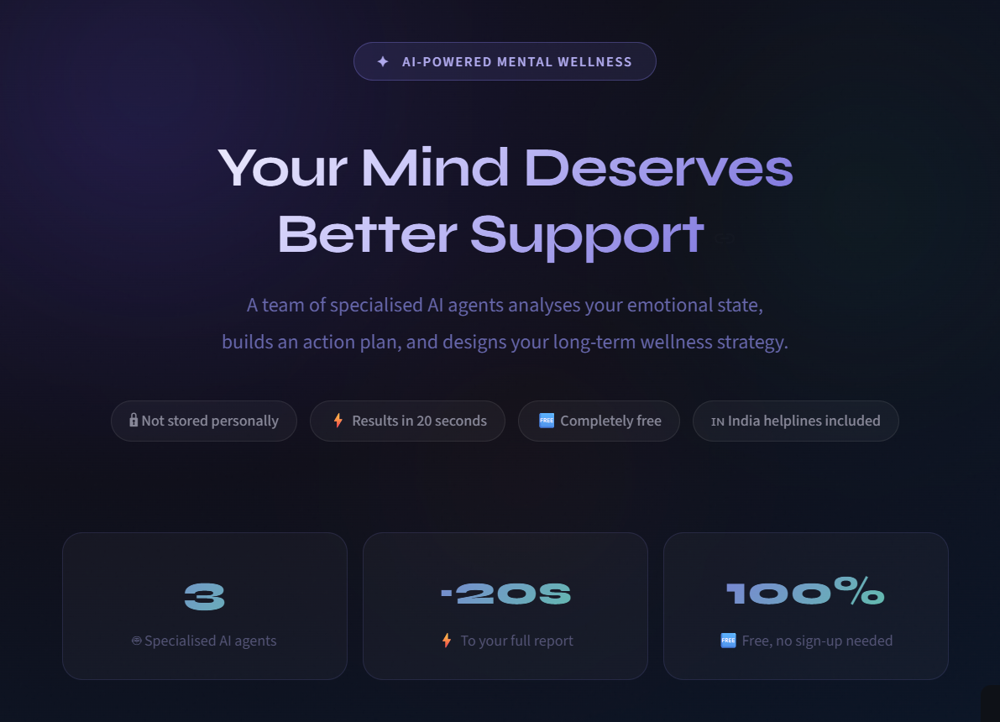
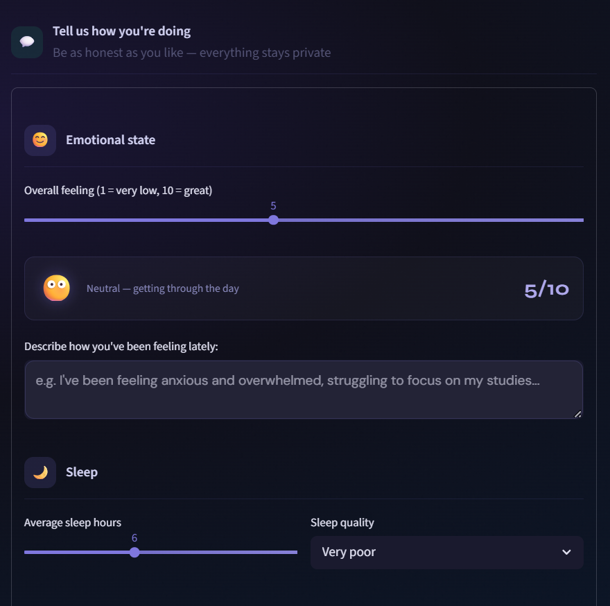
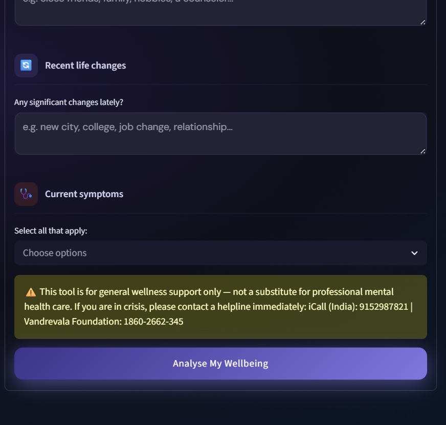
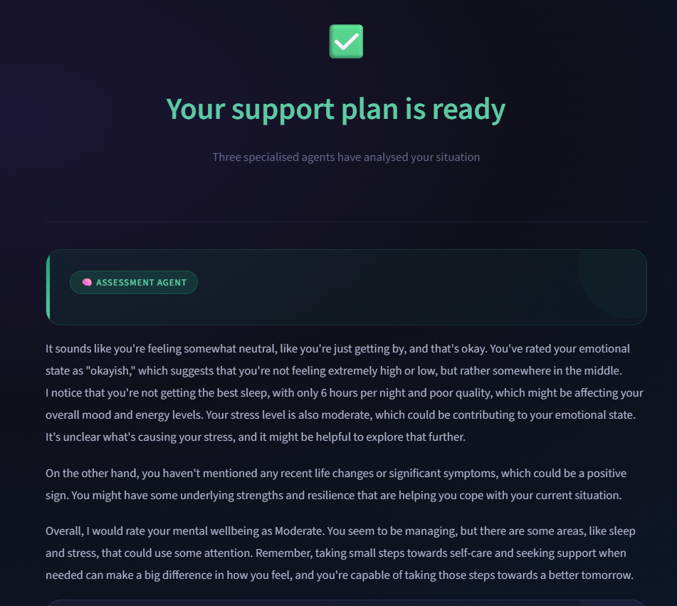
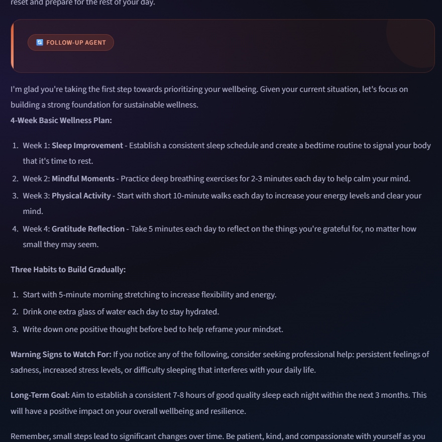

# 🧠 MindCare AI: AI-Powered Multi-Agent Mental Wellness Support System

 

MindCare AI is an intelligent mental wellness assistant designed to help users better understand, reflect on, and manage their emotional wellbeing through AI-driven conversational support.

Built using Python, Streamlit, and Groq-powered LLMs, the system leverages a multi-agent AI architecture where specialised agents collaboratively analyze emotional states, generate practical coping strategies, provide wellness guidance, and deliver crisis-aware support recommendations — all through a modern, interactive interface.

The project focuses on combining AI engineering with human-centered design to create a safe, accessible, and privacy-conscious wellness experience.

🔗 **Live Demo:** [MindCare AI Live Application](https://mindcare-ai-assistant.streamlit.app/) 

---

## 📌 Project Overview

Mental wellness support systems often face challenges such as:

* Lack of accessibility
* Limited personalization
* Inadequate emotional context understanding
* Poor continuity in wellness guidance
* Concerns around user privacy and sensitive data handling

MindCare AI addresses these challenges by building an AI-powered multi-agent workflow capable of:

* Assessing emotional wellbeing through conversational analysis
* Generating personalized coping recommendations
* Supporting long-term wellness reflection
* Detecting crisis-related emotional signals
* Visualizing mood and stress patterns over time
* Maintaining a privacy-conscious user experience

The platform demonstrates how Large Language Models and agent orchestration can be applied to real-world emotional support systems in a responsible and user-centric manner.

---

## 🏗️ System Architecture

The orchestrator coordinates communication between specialized AI agents and manages response synthesis, safety routing, and crisis-aware handling.

```text
User Input 
   ↓ 
AI Orchestrator 
   ├── Assessment Agent 
   ├── Action Agent 
   └── Follow-Up Agent 
   ↓ 
Combined Wellness Response
```
## 🧩 Tools & Technologies Used

| Technology | Purpose |
| :--- | :--- |
| **Python** | Core application development |
| **Streamlit** | Interactive frontend interface |
| **Groq API** | High-speed LLM inference |
| **Llama Models** | AI-driven conversational intelligence |
| **Custom CSS** | UI styling and animations |
| **JSON** | Lightweight session tracking and storage |

---

## ✨ Core Features

* **🤖 Multi-Agent AI Architecture:** Implements a coordinated agent workflow where specialized AI agents handle different aspects of emotional wellness analysis and support.
* **🧠 Emotional Wellness Assessment:** Analyzes user responses to identify emotional patterns, stress indicators, and overall wellbeing signals.
* **🎯 Personalized Coping Strategies:** Generates practical and context-aware wellness recommendations tailored to the user’s emotional condition.
* **🔄 Long-Term Wellness Guidance:** Provides follow-up wellness suggestions focused on consistency, self-care habits, and emotional resilience.
* **🚨 Crisis-Aware Safety System:** Includes keyword-based crisis detection to identify potentially harmful emotional situations and provide appropriate support guidance.
* **📈 Mood & Stress Tracking:** Tracks wellness metrics over time through lightweight anonymous session-based analytics.
* **🎨 Modern Interactive UI:** Built with Streamlit and custom CSS animations to deliver a clean, engaging, and responsive user experience.
* **🔒 Privacy-Conscious Design:** Minimizes sensitive data storage while still enabling progress visualization and wellness tracking.

---

## 📊 AI Workflow

1. **Emotional Assessment:** The Assessment Agent evaluates emotional indicators, stress levels, and user sentiment patterns.
2. **Action Planning:** The Action Agent generates practical coping mechanisms, wellness exercises, and actionable recommendations.
3. **Follow-Up Guidance:** The Follow-Up Agent provides long-term wellness suggestions and emotional support continuity.
4. **Crisis Detection & Safety Routing:** The system scans for crisis-related keywords and activates safety-aware response behavior when necessary.

---

## 📸 Application Screens

* **🏠 Landing Interface:** Modern animated wellness dashboard with guided interaction flow.
  
* **📝 Wellness Assessment Form:** Interactive emotional wellbeing questionnaire designed for reflective user input.
  
  
* **📊 AI Wellness Report:** Personalized AI-generated emotional wellness analysis with actionable recommendations.
  
   
---

## 🔐 Privacy & Data Handling

MindCare AI follows a privacy-conscious system design focused on minimizing sensitive data collection. 

**The application:**
* Does not permanently store personal emotional descriptions.
* Does not require user authentication or account creation.
* Temporarily stores anonymous wellness metrics only for progress visualization.

**Stored Metrics Include:**
* Emotional state score
* Stress level
* Sleep duration
* Timestamp metadata

This approach allows users to monitor emotional trends while reducing exposure of personally sensitive information.

---

## ⚙️ Local Installation & Setup

**1. Clone the Repository**
```bash 
git clone [https://github.com/VajraKalekar/mental-wellbeing-agent.git](https://github.com/VajraKalekar/mental-wellbeing-agent.git) 
cd mental-wellbeing-agent
```

**2. Install Dependencies**

```bash
pip install -r requirements.txt
```
**3. Configure Environment Variables**

Create a .env file and add:
```env 
GROQ_API_KEY=your_api_key_here
```

**4. Run the Application**
```bash
streamlit run app.py
```

## 📂 Project Structure
```Plaintext
mental-wellbeing-agent/ 
│ 
├── agents/ 
│   ├── assessment_agent.py 
│   ├── action_agent.py 
│   └── followup_agent.py 
│ 
├── utils/ 
│   └── groq_client.py 
│ 
├── app.py 
├── orchestrator.py 
├── tracker.py 
├── charts.py 
├── requirements.txt 
└── session_data.json
```

## 📈 Key Learning Outcomes

This project strengthened practical experience in:

* AI agent orchestration
* Large Language Model integration
* Prompt engineering workflows
* Streamlit application development
* Emotional AI system design
* Privacy-conscious software architecture
* Conversational UX design
* AI safety and crisis-aware response handling

## 🚀 Future Enhancements
* Planned improvements for the platform include:
* Secure cloud database integration
* User authentication and profiles
* Multilingual AI support
* Voice-based interaction
* Mobile-first responsive experience
* Advanced wellness analytics dashboard
* Journaling and reflection modules
* Enhanced AI memory and contextual continuity

## ⚠️ Disclaimer
MindCare AI is designed for educational purposes and emotional wellness assistance only. The application is not intended to replace professional mental health services, medical diagnosis, therapy, or emergency intervention. Users experiencing severe emotional distress or crisis situations should contact licensed mental health professionals or emergency support services immediately.

## 👨‍💻 Author
Vajra Kalekar
